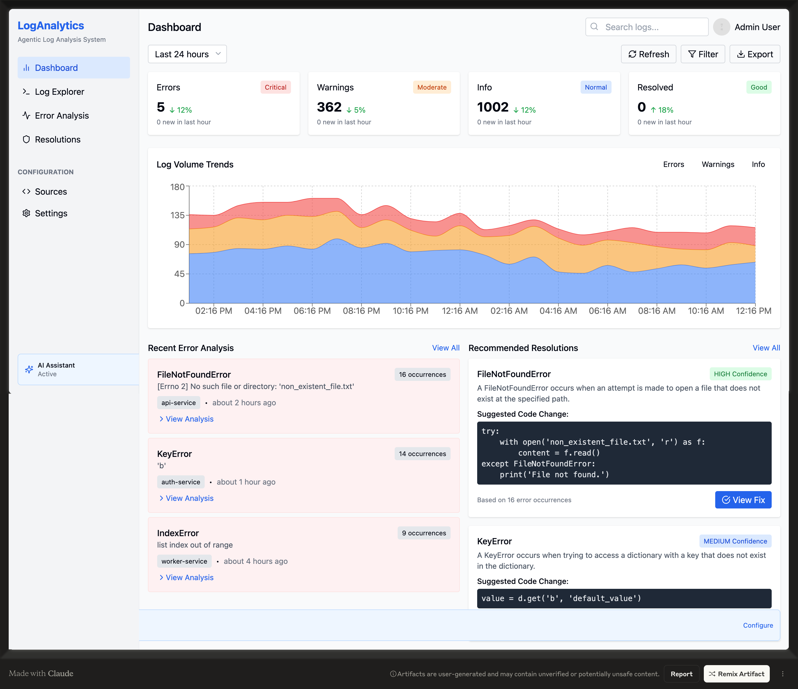

# Agentic-Log-AI

A modern analytics Log Analyzer and Code Fix Tool built with Streamlit, featuring data visualization and analysis capabilities.

## 📸 Screenshots





## Prerequisites

Before you begin, ensure you have the following installed on your system:
- Python 3.10 or higher
- pip (Python package installer)

## Installation

1. Clone the repository:
```bash
git clone <your-repository-url>
cd Log AI
```

2. Create and activate a virtual environment:

For macOS/Linux:
```bash
python -m venv venv
source venv/bin/activate
```

For Windows:
```bash
python -m venv venv
.\venv\Scripts\activate
```

3. Install the required dependencies:
```bash
pip install -r requirements.txt
```

## Key Dependencies

The application uses several key packages:
- `streamlit>=1.31.0`: Web application framework
- `pandas>=2.2.0`: Data manipulation and analysis
- `plotly>=5.18.0`: Interactive data visualization
- `matplotlib>=3.8.0`: Static data visualization
- `langchain-community>=0.0.10`: AI/ML workflow management
- `python-dotenv>=1.0.0`: Environment variable management

## Running the Application

To start the application, run:
```bash
streamlit run app.py
```

The application will open in your default web browser at `http://localhost:8501`.

## Environment Variables

If the application requires any API keys or configuration, create a `.env` file in the root directory with the following format:

```
API_KEY=your_api_key_here
OTHER_CONFIG=other_value
```

## Project Structure

```
spark/
├── app.py              # Main application file
├── requirements.txt    # Project dependencies
├── venv/              # Virtual environment (not tracked in git)
├── .env               # Environment variables (not tracked in git)
└── README.md          # This file
```

## Smart Log Analyzer

The Smart Log Analyzer helps you analyze log files and identify error patterns using AI.

─────────────────────────────── Instructions ────────────────────────────────
Welcome to Smart Log Analyzer

This tool helps you analyze log files and identify error patterns using AI. Here's how to get the most out of it:

1. Basic review - Quick analysis without code examination
2. In-depth review - Comprehensive analysis with source code fixes

You can analyze all detected log files or pick specific ones by index. The tool will suggest fixes and provide insights about error patterns.
─────────────────────────────────────────────────────────────────────────────

### Usage Flow
- The tool searches for log files in the project (recursive, max depth: 4).
- Found log files are listed with their index and size.
- You can select a review mode:
  1. Basic log review (fast, log-only): Analyzes log files without examining source code - quick analysis of error patterns.
  2. In-depth review with code fixes (slower, analyzes source files): Deep analysis with source code examination and suggested code fixes for errors.
- Choose to process all log files or select specific ones by index.
- The tool will analyze and provide suggestions or fixes.

### Example Output
```
Found 1 log file(s).
┏━━━━━━━┳━━━━━━━━━━━━━━━━━━━━━━━━━━━━━━━━━━━━━━━━━━━━━━━━┳━━━━━━━━━━━┓
┃ Index ┃ Log File                                       ┃ Size      ┃
┡━━━━━━━╇━━━━━━━━━━━━━━━━━━━━━━━━━━━━━━━━━━━━━━━━━━━━━━━━╇━━━━━━━━━━━┩
│ 1     │ ./simulator/log_generator/simulated_system.log │ 346.79 KB │
└───────┴────────────────────────────────────────────────┴───────────┘

Available Review Modes:
1. Basic log review (fast, log-only)
2. In-depth review with code fixes (slower, analyzes source files)

Available Actions:
1. Process all log files
2. Select specific log file(s)
3. Exit
```

### Note on LangChain Deprecation
You may see the following warning:
```
LangChainDeprecationWarning: The class `ChatOpenAI` was deprecated in LangChain 0.0.10 and will be removed in 1.0. An updated version of the class exists in the :class:`~langchain-openai package and should be used instead. To use it run `pip install -U :class:`~langchain-openai` and import as `from :class:`~langchain_openai import ChatOpenAI``.
```
This does not affect the current functionality, but you may wish to update your dependencies in the future.

### Running with Docker
To run the log analysis stack (Loki, Promtail, Grafana) using Docker Compose, use the following commands:

Start all services in the background:
```bash
docker-compose up -d
```

Check the status of running containers:
```bash
docker-compose ps
```

Stop all services:
```bash
docker-compose down
```

### Running the CLI Agent
To use the Smart Log Analyzer CLI agent, navigate to the `agent` directory and run:

```bash
cd agent
python cli.py
```

You can also use the following options:
- Analyze a specific log file:
  ```bash
  python cli.py --log-file path/to/your.log
  ```
- Search recursively for log files:
  ```bash
  python cli.py --recursive
  ```
- Specify a directory to search:
  ```bash
  python cli.py --directory path/to/dir
  ```

### Running the Dashboard
To run the analytics dashboard:

1. Start the required backend services (Loki, Promtail, Grafana) using Docker Compose:
   ```bash
   docker-compose up -d
   ```

2. Once Docker services are running, launch the dashboard (from the `agent` directory):
   ```bash
   streamlit run app2.py
   ```

The dashboard will be available at [http://localhost:8501](http://localhost:8501).

## Contributing

1. Fork the repository
2. Create a new branch for your feature
3. Commit your changes
4. Push to your branch
5. Create a Pull Request
